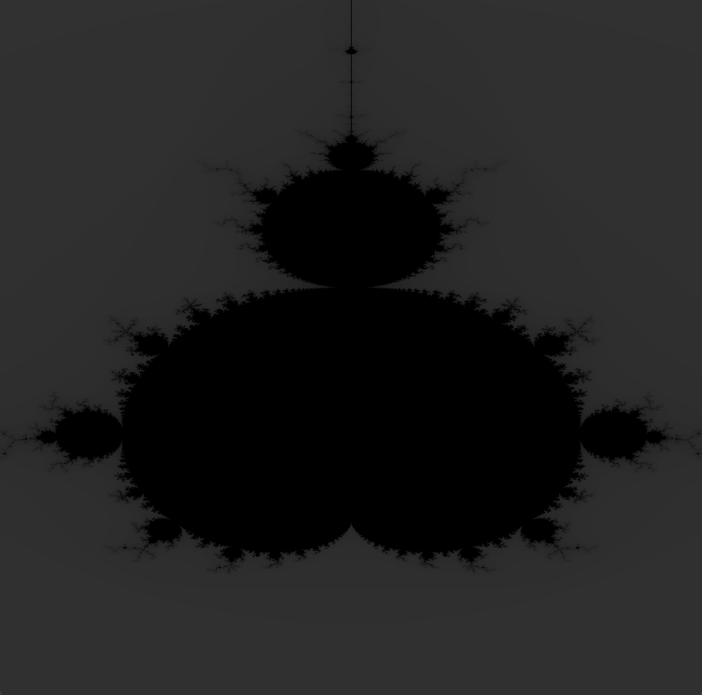

# Mandelbrot Renderer



# Description

An attempt to render the Mandelbrot set, just using SDL and the beautifully dangerous C programming language.

# Building the Project

All that is required is `sdl` and `make` to compile the project.
The build process is pretty simple.

```sh
# use make to compile project
> make
    gcc  -c  -o src/window.o src/window.c
    gcc  -I/opt/homebrew/include/SDL2 -D_THREAD_SAFE src/main.o src/window.o src/complex.o src/mandl.o -o mandl -L/opt/homebrew
    /lib -lSDL2 -lm
# run the final executable
> ./mandl
```
